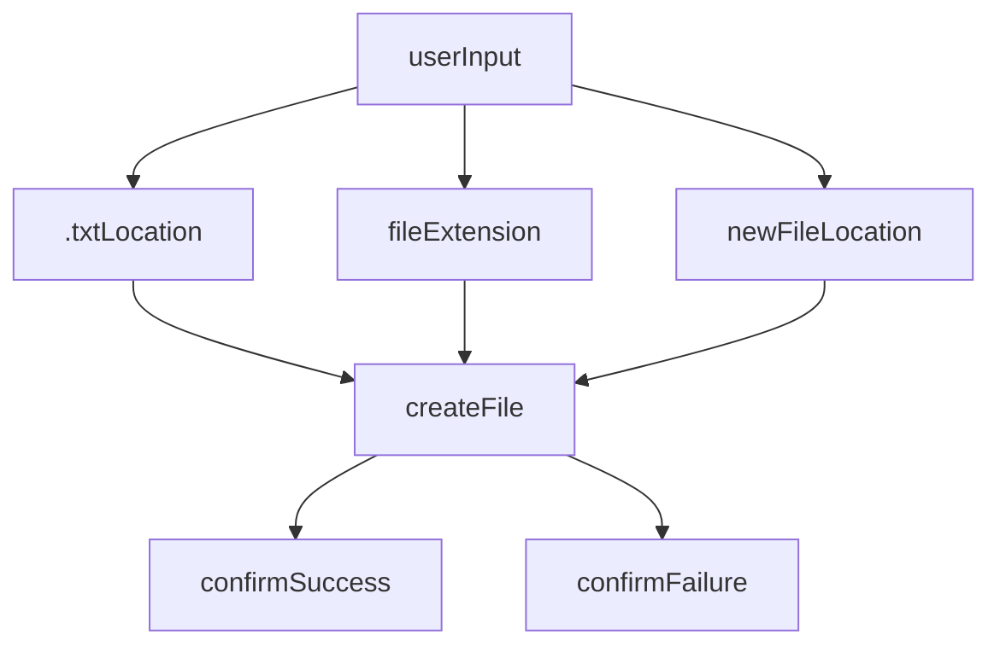

#### basic plan

#### detailed

1. ask user which location to work in
2. user has options between using an existing text file or giving a list of file names to create
3. if user gives list, create a .txt file containing it
4. store in .txt file and/or open it
